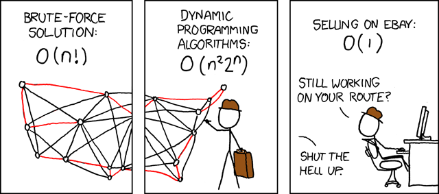

```{r setup, include=FALSE}
knitr::opts_chunk$set(echo = FALSE)
```

# Pourquoi je vous parle de ça?

## 
<div id="left">

</div>

<div id="right">
<br>

- **Etudiant (2012-2013):** INFO-H-414 - Swarm Intelligence
<br>

- **Mémoire (2013-2015):** Spatial Allocation in Swarm Robotics
<br>

- **Actuellement:** Doctorant en Machine Learning

</div>

# Qu'est-ce que c'est?

## Swarm Intelligence

<q> "Swarm intelligence is the discipline that deals with natural and artificial systems composed of many individuals that coordinate using decentralized control and self-organization." </q>

<p style="text-align:right;font-size: 50%;"> 
Marco Dorigo and Mauro Birattari (2007) <a href="http://www.scholarpedia.org/article/Swarm_intelligence">Swarm intelligence</a>. <a href="http://www.scholarpedia.org/">Scholarpedia</a>, 2(9):1462. </p>

## Self-organization
<q>"Self-organization is a process in which pattern at the global
level of a system emerges solely from numerous interactions
among the lower-level components of the system.
Moreover, the rules specifying interactions among the system's
components are executed using only local information, without
reference to the global pattern" </q>

<p style="text-align:right;font-size: 50%;"> Gerardo Beni. From swarm intelligence to swarm robotics. In Swarm
Robotics, pages 1-9. Springer, 2005. </p>

##{data-background="img/BaranDecentralized.png"}

## Taxonomie - Sur base de la nature des agents: 

<div id="left">

<p style="text-indent:-10px;text-align:center;">**Naturel**</p>
</div>

<div id="right">

<p style="text-align:center;">**Artificiel**</p>
</div>

## Taxonomie - Sur base de l'objectif: 

<div id="left">
<br>
$$ y_i = f(?,?,?) $$
<br>
<p style="text-indent:-10px;text-align:center;">
**Scientifique** : 
Comprehension du système
</p>
</div>

<div id="right">
<br>
$$ f(x_1,\cdots,x_n) \rightarrow y_1,\cdots,y_n $$
<br>
<p style="text-align:center;">
**Ingégnerie** :
Exploitation du système</p>
</div>


# Examples - Naturels

## Flocking


## Schooling


## Comment ça marche?


<p style="text-align:right;font-size: 50%;"> Reynolds, Craig W. "Flocks, herds and schools: A distributed behavioral model." ACM SIGGRAPH computer graphics. Vol. 21. No. 4. ACM, 1987. 
<http://www.red3d.com/cwr/boids/>
</p>

## Synchronisation des metronomes
<iframe width="800" height="600" src="https://www.youtube.com/embed/Aaxw4zbULMs" frameborder="0" allow="autoplay; encrypted-media" allowfullscreen></iframe>

## Synchronisation des lucioles
<iframe width="800" height="600" src="https://www.youtube.com/embed/ZGvtnE1Wy6U" frameborder="0" allow="autoplay; encrypted-media" allowfullscreen></iframe>

## Comment ça marche?
<code class="python" data-trim data-noescape>
<pre>
while(True):
  counter +=1

  # Signaling part
  if counter > T:
    signal
    counter = 0
    
  # Synchronization
  if signal_detected:
    counter += alpha * counter

</pre>
</code>

# Examples - Artificiels

## Robotique en essaim

<q> "Swarm robotics is the study of how to design groups of robots that operate without relying on any external infrastructure or on any form of centralized control. In a robot swarm, the collective behavior of the robots results from local interactions between the robots and between the robots and the environment in which they act" </q>

<p style="text-align:right;font-size: 50%;"> 
Marco Dorigo et al. (2014) <a href="http://www.scholarpedia.org/article/Swarm_robotics">Swarm robotics</a>. <a href="http://www.scholarpedia.org/">Scholarpedia</a>, 9(1):1463.
</p>

<p style="text-align:right;font-size: 50%;">
M. Brambilla, E. Ferrante, M. Birattari, and M. Dorigo. Swarm robotics: a review from the swarm engineering perspective. Swarm Intelligence, 7(1):1-41, 2013.
</p>

###Propriètes desirées:

- Tolerance au défauts
- Scalabilité
- Flexibilité

## Transport collectif
<iframe width="800" height="600" src="https://www.youtube.com/embed/seGqyO32pv4" frameborder="0" allow="autoplay; encrypted-media" allowfullscreen></iframe>

## Auto-assemblage
<iframe width="800" height="600" src="https://www.youtube.com/embed/cEKCcs8-O4A" frameborder="0" allow="autoplay; encrypted-media" allowfullscreen></iframe>

## Essaim héterogène 
<iframe width="800" height="600" src="https://www.youtube.com/embed/M2nn1X9Xlps" frameborder="0" allow="autoplay; encrypted-media" allowfullscreen></iframe>


## ACO

<q> Ant colony optimization (ACO) is a population-based metaheuristic that can be used to find approximate solutions to NP-hard optimization problems. </q>

<p style="text-align:right;font-size: 50%;"> Marco Dorigo (2007) <a href="http://www.scholarpedia.org/article/Ant_colony_optimization">Ant colony optimization</a>. <a href="http://www.scholarpedia.org/">Scholarpedia</a>, 2(3):1461.
</p>

<br>

### Pseudo-code
<pre>
1. Initialization fourmis
2. Selection route
3. Mise à jour phéromone
</pre>

## Equations

### ACO - Pseudo-code
<pre>
1. Initialization fourmis
2. Selection route
3. Mise à jour phéromone
</pre>

### Selection route
$$
p_{xy}^k =
\frac
{ (\tau_{xy}^{\alpha}) (\eta_{xy}^{\beta}) }
{ \sum_{z\in \mathrm{allowed}_y} (\tau_{xz}^{\alpha}) (\eta_{xz}^{\beta}) }
$$

### Mise à jour pheromone
$$
\tau_{xy} \leftarrow
(1-\rho)\tau_{xy} + \sum_{k}\Delta \tau^{k}_{xy}
$$

où:

$\eta_{xy}$ represente la valeur héuristique associé au problème

$\tau_{xy}$ represente la valeur du pheromone

## Application - Problème du commis voyageur (TSP)



### Solution possible:
Permutation des villes: $$ [v_1, \cdots, v_n] $$

### Formulation:
$$\eta_{xy} \rightarrow \frac{1}{d_{xy}}$$  

# Et maintenant à vous d'essayer!

## Ici
<h2> <http://www.wooclap.com/LDHHPB> </h2>

##  Mais aussi chez vous!

### ARGOS - Simulateur
<http://www.argos-sim.info/>

### Simulations
<http://iridia.ulb.ac.be/~lgarattoni/h-414/>

#{data-background="img/end.png"}

#Des questions?

